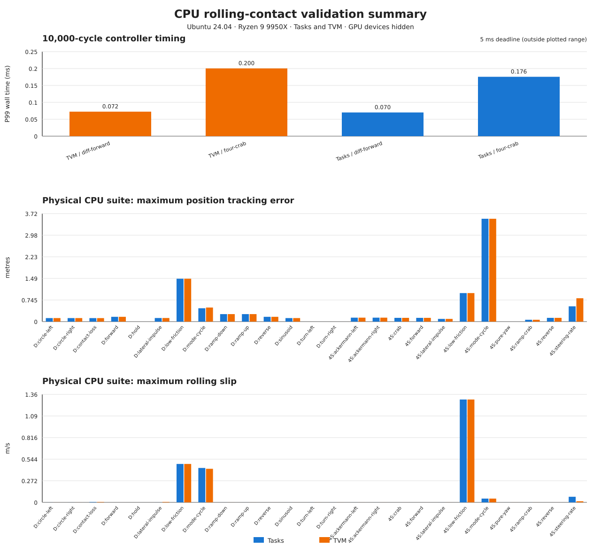

# CPU rolling-contact final evidence

Date: 2026-09-02 (Asia/Shanghai)

Status: **Pass — complete CPU implementation**

This checkpoint closes the roadmap in `Task-Rolling-Contact.md`. Differential-drive and four-steering rigid-wheel
rolling contact are implemented through the native Tasks and TVM CPU solver paths. The geometry kernel, controller,
tests, MuJoCo runner, and production targets neither discover nor require a GPU. All final commands ran with
`CUDA_VISIBLE_DEVICES=-1` where a process could inspect devices.

The compact machine-readable checkpoint is `final-report.json`. Per-scenario simulation metrics are retained in
`mujoco-summary.json`, the 10,000-cycle performance results in `timing-summary.json`, and the dynamic dependency proof
in `cpu-linkage-summary.json`. `validation-summary.svg` plots timing, position-error, and slip evidence directly from
those retained JSON summaries; `scripts/plot-evidence.py` reproduces it without third-party plotting dependencies.
Large replay logs and binaries remain outside Git under `/tmp`, as required by the roadmap; their hashes are recorded
below.

## Revisions and environment

| Component | Revision or value |
| --- | --- |
| mc_rtc base | `fc7df14a96f1273fb1aaff8e1a84ef514455d29c` |
| mc_rtc implementation | the commit containing this report; the final commit hash is reported by Git after commit |
| Tasks source / version | `4d9fe01018ff0906475c829568b5d23b6705327a` / 1.8.4 |
| TVM source / version | `e82b990e0b556efe33c1dc5fe2cae42bf423a19b` / 0.9.5 |
| mc_mujoco | `9397c73fcc348f4f2a3d2f433dcaf948a67532ea` plus the tracked user-destination patch |
| MuJoCo | 3.3.6, pinned archive SHA-256 in `build-cpu-mujoco-runner.sh` |
| Host | Ubuntu 24.04, x86_64 |
| CPU | AMD Ryzen 9 9950X, 16 physical cores / 32 logical CPUs, SMT2, one NUMA node, boost enabled |
| Toolchain | GCC `13.3.0-6ubuntu2~24.04.1`, CMake 3.28.3, C++17, `RelWithDebInfo` |
| Solvers | Tasks QLD CPU path; TVM default weighted least-squares CPU path |
| Timing setup | one controller process, single-threaded controller/solve path, 5 ms period, no asynchronous device work |

The working tree used for measurements contained the complete rolling-contact patch but was not yet committed. The
unrelated untracked `AGENTS.md` and `colorful-guidance.md` were excluded from the implementation commit. A final clean
staged-checkout build/test gate proves that retained evidence is not relying on any other untracked source.

## Stage closure

| Stage | Status | Direct evidence |
| --- | --- | --- |
| Roadmap and source audit | Pass | `Task-Rolling-Contact.md`, normative QP report |
| 0 — baseline and architecture | Pass | `architecture.md`, `stage-0.md`, final full regression |
| 1 — toy robots | Pass | robot loaders, URDF/RSDF assets, `testRollingContactRobot` |
| 2 — standalone rolling math | Pass | `testRollingContact`, finite differences, 10,000-update allocation test |
| 3 — minimal solver insertion | Pass | hard/soft Tasks and TVM cases in `testRollingContactSolver` |
| 4 — dynamic contact forces | Pass | point/cone columns, virtual work, wheel torque, stable-layout tests |
| 5 — differential controller | Pass | deterministic ticker and lifecycle/mode CTests |
| 6 — differential CPU MuJoCo | Pass | flat, ramps, low friction, impulse, contact loss, replay matrix |
| 7 — contact modes | Pass | fixed/rolling/sliding/detached unit, ticker, and simulation transitions |
| 8 — four-steering QP | Pass | straight, reverse, crab, Ackermann, pure yaw, steering-rate, ramp cases |
| 9 — CPU backend parity | Pass | direct coefficient/solution parity and all controller/simulation cases on both backends |
| 10 — regression and handoff | Pass | 102/102 CTest, ASan, timing, linkage, schemas, docs, clean staged checkout |

No gate is failed or blocked.

## Implemented architecture and inventory

The backend-neutral `mc_rbdyn` layer distinguishes the carrier center from the instantaneous force point, constructs
the right-handed rolling frame `[t, l, n]`, and computes geometry, velocity and acceleration rows, bias, force
endpoints, and diagnostics without heap allocation after warm-up. `RollingContactConstraint` supplies rolling rows;
`RollingContactDynamicsConstraint` supplies the instantaneous line-force geometry and friction cones. Persistent
identities preserve Tasks lambda offsets and TVM point-force variables across numerical updates and mode changes.

Tasks keeps its native reduced vector: generalized acceleration plus contact multipliers. Torque remains reconstructed
by `MotionConstr`, and soft longitudinal rolling is an ordinary quadratic residual rather than a fictitious slack
variable. A repository-local `RollingMotionConstr` updates the rolling point/cone generalized-force columns without
patching Tasks or rebuilding the contact set every cycle.

TVM keeps explicit point forces and an actuated-only torque variable. Floating-base effort is excluded from the
decision vector and the six base entries are explicitly zeroed when the result is copied to the robot. Removed TVM
graph objects enter a solver-owned retirement queue until weighted-least-squares caches have been refreshed by the next
solve. This fixed a lifecycle use-after-free found by the repeated removal/re-add test; 50 targeted lifecycle runs, 20
complete solver runs, and the final ASan set are now green.

Principal tracked artifacts are:

- `include/mc_rbdyn/RollingContact.h` and `src/mc_rbdyn/RollingContact.cpp`;
- `RollingContactConstraint`, `RollingContactDynamicsConstraint`, and `mc_tvm::RollingContactFunction`;
- installable `RollingContactDifferential` and `RollingContactFourSteering` robots with descriptions and aliases;
- the `RollingContact` sample controller, Tasks/TVM configurations, mode logic, diagnostics, logger, and GUI entries;
- four geometry/robot/solver/controller test families registered with CTest;
- English and Japanese tutorials, schemas, example configurations, ADR-001, and the normative QP report; and
- CPU linkage, controller-log, MuJoCo build/run/check, evidence-compaction, and plotting inputs.



## Build, CTest, sanitizer, and lifecycle evidence

The final incremental build completed successfully. The rolling-focused command was:

```sh
CUDA_VISIBLE_DEVICES=-1 MC_RTC_DISABLE_CONVEX_GENERATION_PATCH=ON \
  ctest --test-dir build -R 'RollingContact|testRollingContact' --output-on-failure -j1
```

Result after the keyboard tracking fix: exit 0, **13/13 tests passed** in 1.86 seconds.

The full repository regression command was:

```sh
MC_RTC_CONTROLLER_CONFIG=/tmp/mc_rtc-no-gui.yaml CUDA_VISIBLE_DEVICES=-1 MC_RTC_DISABLE_CONVEX_GENERATION_PATCH=ON \
  ctest --test-dir build --output-on-failure -j1
```

Result after the keyboard tracking fix: exit 0, **102/102 tests passed** in 34.93 seconds. The regression run used
`MC_RTC_CONTROLLER_CONFIG=/tmp/mc_rtc-no-gui.yaml` to disable nanomsg GUI sockets in the sandbox. This includes every
previously passing test and all new rolling tests. The command ran serially because the framework tests share
user/cache and IPC resources.

The address-sanitized geometry, robot, solver, and repeated-controller-lifecycle set passed **4/4** in 1.41 seconds
with `ASAN_OPTIONS=detect_leaks=0:abort_on_error=1`. The dedicated repeated lifecycle test also passed 50 consecutive
runs, and the complete rolling solver test passed 20 consecutive runs after the TVM retirement-queue correction.

The final clean staged-checkout gate applies only the exact index patch to a detached worktree, configures a separate
`RelWithDebInfo` build, builds the rolling libraries/robots/controller/tests and ticker, and reruns the rolling CTests
with devices hidden. This is the release check for accidental reliance on untracked developer files.

## Numerical and allocation evidence

The test corpus checks orthonormal/right-handed rolling frames, translated and yaw-rotated planes, positive and
negative ramps, unequal radii, zero/negative radius, invalid friction and NaN data, analytical planar identities,
central finite differences, acceleration bias, point generalized force, friction generators, dynamics, force/torque
bounds, rank, modes, and remove/re-add behavior.

Direct Tasks/TVM results at the common deterministic state are:

| Quantity | Measured error | Acceptance |
| --- | ---: | ---: |
| rolling coefficient matrix | `0` | `1e-10` absolute |
| acceleration bias | `0` | `1e-10` absolute |
| generalized acceleration | `3.530393869375426e-7` | `1e-6` scaled |
| actuated torque | `6.60888592104069e-16` | `1e-7` scaled |
| resultant contact wrench | `4.236472619822962e-6` | `1.186798e-5` scaled |
| TVM soft-rolling residual | `4.982765543864147e-10` | hard/soft residual policy |

The looser `1e-6` state threshold is confined to TVM's redundant static-hold weighted least-squares solution; matrix
coefficients remain exact and torque/wrench satisfy the roadmap's scaled `1e-7` comparison. The geometry hot loop
performed **10,000 updates with zero heap allocations after warm-up**, enforced by a test assertion.

## CPU-only dependency proof

The linkage audit inspected five production/integration targets: `libmc_rbdyn`, `libmc_solver`, the rolling robot
module, rolling controller module, and lifecycle executable. Every target resolved all dynamic libraries and reported
an empty GPU-runtime list. The rejected families include CUDA, cuBLAS, cuSolver, Torch, HIP, and OpenCL.

The retained compact report is `cpu-linkage-summary.json`. Its source report SHA-256 is
`30bf3dae6f9e08a39d062b95d9ab1ca16619d2c816c087ea1205b9af295fa7af`. The test environment hid GPU devices, the
runner reported `device: CPU`, and there is no rolling-contact GPU build option or fallback path.

## CPU MuJoCo validation

The pinned, headless runner exercised the following 25 named cases on **both Tasks and TVM**:

- differential: hold, forward, reverse, left/right turn, left/right circle, sinusoid, ramp up/down, low friction,
  lateral impulse, contact loss, and the complete contact-mode cycle;
- four steering: forward, reverse, crab, left/right Ackermann, pure yaw, nonzero steering rate, ramp crab, lateral
  impulse, low friction, and the complete contact-mode cycle.

Each of the 50 backend/case pairs ran five deterministic repetitions: **250 processes**, 1,000 cycles plus 100 warm-up
cycles each. All reports were finite, completed their requested cycles, passed case-specific frozen thresholds, had no
controller failures, and accumulated **zero missed 5 ms deadlines**. Nominal cases check no-slip/tracking/contact
metrics; low-friction cases require measurable slip and a non-rolling estimate; disturbance cases require fallback and
recovery; mode cycles must observe fixed, rolling, sliding, and detached; repeated results are bitwise/numerically
deterministic for the declared fields.

Worst observed P99 controller time was **0.346865 ms** and the minimum real-time factor was **20.5284**, both in the TVM
four-steering-rate case. Peak RSS was **52,312 KiB**. All 50 per-scenario tracking, odometry, slip, force, torque,
timing, memory, final-mode, and configuration-hash records are in `mujoco-summary.json`.

The source suite report is `/tmp/rolling-contact-final-mujoco-v7/suite-report.json`, SHA-256
`d323fc4d1dc179d5be9786e4f2915a5571559abcdfdbf04b672cf3f10eb4ab2c`. The runner SHA-256 is
`3b2408b023f015553c78ccabf9fec7dde2544acfc00d4d0caebf9c24a9c2cd1a`. Absolute `/tmp` paths document the measured
host only; all sources/configuration needed to regenerate them are tracked and use repository-relative discovery.

### Ranger Mini V3 and keyboard handoff

The four-steering MuJoCo mapping now selects the tracked `ranger_mini_v3` alias and the self-contained primitive model
at `src/mc_robots/rolling_contact_description/mujoco/ranger_mini_v3.xml`. It uses the AgileX/SysWonder dimensions
(0.494 m wheelbase, 0.364 m track, 0.125 m radius), four steering/drive pairs, and explicit chassis/wheel collision
exclusions. The exclusions are necessary because the four wheel centers lie within the visible body envelope; without
them MuJoCo creates artificial self-contact impulses before the first QP solve.

Interactive operation is provided by the optional RoboticsUtils `KeyboardCapture` target. The controller starts it
only for the `keyboard` scenario and fails clearly when standard input is not a TTY or RoboticsUtils is unavailable.
W/S command forward/reverse, A/D command left/right crab motion, Q/E command left/right yaw, `space` clears all
latched axes, and `x` stops capture. Since a terminal emits a byte per key press rather than a release state, each
axis remains latched until its opposite key or `space` is pressed. In the Tasks backend the controller sends wheel-rate
feed-forward through the posture task and writes chassis linear/angular feed-forward into the position/orientation
tasks. Before every closed-loop cycle, it synchronizes MuJoCo encoder values and the `FloatingBase` body sensor into
its MBC. After the QP succeeds, it emits measured-state-relative wheel position and velocity references (`q`/`alpha`),
which are the signals consumed by mc_mujoco's actuator adapter. This closes the previous gaps where the chassis target
could integrate while the task velocity stayed zero and the controller could keep evaluating an initial, stale chassis
pose. The adapter converts a stopped capture into zero references, so the helper's retained last command cannot keep
the robot moving. The `RollingContact::GetKeyboardStatus` datastore call plus the reference-speed, base-target,
task-reference, and tracking-error log entries make the full handoff visible to a GUI or log consumer. A pseudo-terminal
smoke run produced nonzero wheel targets and a measured chassis velocity close to the requested value, then cleanly
restored the terminal after X; the simulator is stopped with the MuJoCo close action or Ctrl-C.

The controller handles `x` in two phases: the callback atomically requests a stop, and the next controller poll calls
`KeyboardCapture::stop()` from the controller thread. This avoids asking the RoboticsUtils input worker to join itself
and guarantees that terminal settings are restored before the capture object is destroyed.

The final closed-loop trace is
`/tmp/mc-rtc-ranger-mini-v3-keyboard-RollingContact-2026-09-02-15-11-40.bin`; the inspected 90--145 second segment is
also retained as `/tmp/ranger-keyboard-validated_from_90_to_145.bin`. The active window runs from 99.465 through
120.875 seconds with `W` held: the command and chassis-task
reference were `0.300 m/s`, the measured chassis velocity settled at `0.2875246 m/s` (95.8% of command), and the
measured front-left wheel rate settled at `2.3003195 rad/s` against `2.4 rad/s`. The target advanced to `6.4245 m`,
the measured chassis reached `6.1573383 m`, and the final stopped position error was `0.267145 m`; unlike the original
log, the error remained bounded rather than growing at the full target rate. Every recorded solver-success sample was
true. After `x`, the command, wheel reference, wheel velocity, and chassis velocity all reached exactly zero, and the
terminal output confirmed that the input worker stopped and terminal capture was restored.

## 10,000-cycle CPU timing gate

Four representative production cases each ran 100 warm-up plus 10,000 measured cycles. Every P99 is far below the
5 ms period and no case missed a deadline.

| Backend / case | Median ms | P95 ms | P99 ms | Max ms | RTF | Peak RSS KiB |
| --- | ---: | ---: | ---: | ---: | ---: | ---: |
| Tasks / differential forward | 0.044740 | 0.064231 | 0.070081 | 0.226873 | 86.1634 | 50,648 |
| Tasks / four-wheel crab | 0.118021 | 0.151712 | 0.175613 | 0.238283 | 35.5080 | 51,648 |
| TVM / differential forward | 0.047081 | 0.058371 | 0.072461 | 0.145982 | 83.3322 | 52,148 |
| TVM / four-wheel crab | 0.136831 | 0.175352 | 0.200392 | 0.357224 | 31.0695 | 52,672 |

The source timing report SHA-256 is
`88c607a2db9a20e87770e2fe0ef2fe6f8246113d810ee5fd8af25fb568dcf818`; the compact retained data are in
`timing-summary.json`.

## Reproduction commands

From a dependency-complete CPU checkout:

```sh
cmake -S . -B build -DCMAKE_BUILD_TYPE=RelWithDebInfo -DBUILD_TESTING=ON
cmake --build build -j2
CUDA_VISIBLE_DEVICES=-1 MC_RTC_DISABLE_CONVEX_GENERATION_PATCH=ON \
  ctest --test-dir build -R 'RollingContact|testRollingContact' --output-on-failure -j1
MC_RTC_CONTROLLER_CONFIG=/tmp/mc_rtc-no-gui.yaml CUDA_VISIBLE_DEVICES=-1 MC_RTC_DISABLE_CONVEX_GENERATION_PATCH=ON \
  ctest --test-dir build --output-on-failure -j1
ctest --test-dir build -R '^RollingContactCPULinkage$' --output-on-failure
```

Build the isolated pinned CPU MuJoCo runner and generate the suite:

```sh
CUDA_VISIBLE_DEVICES=-1 rolling-contact-report/scripts/build-cpu-mujoco-runner.sh
CUDA_VISIBLE_DEVICES=-1 python3 rolling-contact-report/scripts/run-mujoco-suite.py \
  --runner /tmp/rolling-contact-cpu-mujoco/runner-build/rolling_contact_mujoco_runner \
  --build build --artifact-dir /tmp/rolling-contact-mujoco-results --repetitions 5
```

For an interactive Ranger session after `mc_mujoco` is installed at `~/local/bin/mc_mujoco` and the
`~/local/share/mc_mujoco/ranger_mini_v3.yaml` mapping is present:

```sh
source /opt/ros/jazzy/setup.bash
export CUDA_VISIBLE_DEVICES=-1 MC_RTC_DISABLE_CONVEX_GENERATION_PATCH=ON
export LD_LIBRARY_PATH="$PWD/build/src:$PWD/build/plugins/ROS:$PWD/build/deps/tasks-system-install/lib:/usr/local/lib:/opt/ros/jazzy/lib"
/home/yuquan/local/bin/mc_mujoco -s -f rolling-contact-report/config/mc_rtc-ranger-mini-v3-keyboard.yaml
```

The complete command/key reference is maintained in [`rolling-contact-report/README.md`](../README.md).

The suite driver invokes `check-mujoco-report.py` for every report. JSON validity is checked with `jq empty`; Python
helpers are compile-checked; the shell runner is checked with `bash -n`; changed C++ and CMake files follow the
repository pre-commit format policy.

## Deviations, fixes, and limitations

No external Tasks patch was required. The only companion patch makes mc_mujoco's user configuration destination
overrideable so the pinned runner can install into an isolated `/tmp` prefix. The TVM graph-lifetime defect discovered
during full regression is documented above and is covered by stress and sanitizer tests rather than hidden as a flaky
failure.

Current supported scope is rigid differential and four independently steering/driving wheels on a supplied plane or
constant-slope ramp. Each instantaneous line contact uses a four-ray polyhedral cone at two endpoints. Tire
deformation, rolling resistance, complementarity, and online terrain estimation are not modeled. The planar
four-steering specialization selects two independent hard lateral rows to avoid redundant geometric constraints.
Mode thresholds must be retuned and revalidated for materially different wheel/terrain properties or controller
periods. Timing numbers characterize the recorded CPU/toolchain and are not a portable worst-case execution-time
guarantee.
